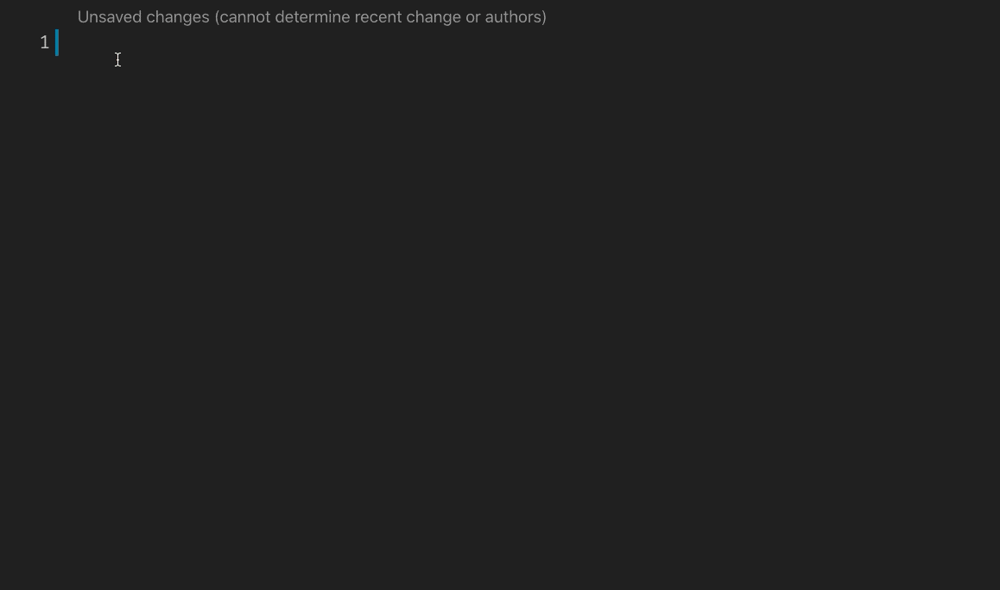

# nunjucks-vscode-snippets 

A tight and simple collection of usefull nunjucks snippets

## Usages

### Snippets

| Prefix      | HTML Snippet Content                             |
| ----------- | ------------------------------------------------ |
| `var`       | `{{ variable }}`                                 |
| `extends`   | ``                       |
| `include`   | ``                       |
| `inject`    | ``                        |
| `for`       | ` `         |
| `if`        | ` `                 |
| `ife`       | `if else`                                        |
| `ifel`      | `if elif`                                        |
| `elif`      | `elif`                                           |
| `else`      | `else`                                           |
| `bdt`       |  bodytext | safe                                 |
| `link`      | `adds Malvid link formatting`                    |
| `row`       | `adds BasicGrid row and columns`                 |